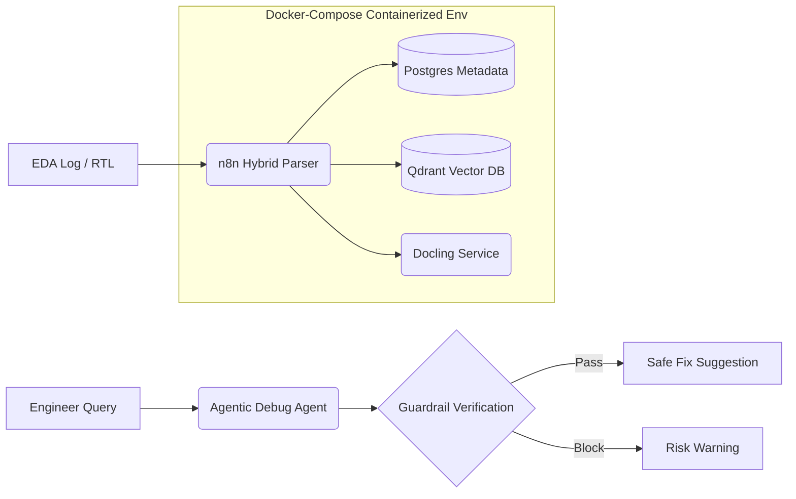

# Agentic-EDA Copilot

> **2026 智慧創新大賞 (Best AI Awards) 參賽專案**
> 讓硬體工程師從手動翻閱上萬行 EDA Log 的苦工中解脫，轉型為指揮多個 AI Agent 的系統指揮家。

---

## 📌 核心痛點：晶片設計的生產力危機

現代晶片動輒整合數百億電晶體，從 RTL 到 GDS 的迭代週期往往以天計算。工程師長期面對三大挑戰：

- **Code-Reality Gap**：程式碼行為和實際電路結果對不上，只能人工逐行閱讀非結構化 Log
- **效率瓶頸**：重複性分析耗盡工程師心力，整體迭代速度難以提升
- **資安顧慮**：將敏感 IP 上傳至雲端 LLM，對半導體公司而言風險難以接受

---

## 🚀 三大特色功能

### 1. Hybrid RAG 精準除錯

結合 Regex 預處理與優先級評分的兩階段管線：

- 先用規則腳本將 Log 結構化、過濾雜訊
- 再交由 LightRAG 進行語意檢索與錯誤定位
- **錯誤偵測率接近 100%**，大幅改善純 LLM RAG 的幻覺問題

### 2. Neuro-symbolic Guardrail 剛性驗證

在 `Agentic Debug Query` 流程中嵌入 JavaScript 規則校驗層，防止 AI 給出危險建議：

| 規則 | 保護內容 |
|------|----------|
| G1 | 攔截未經 STA 驗證的時鐘頻率修改建議 |
| G2 | 禁止直接修改 GDSII 佈局，必須先通過物理 DRC 檢查 |
| G3 | 標記拓樸變更建議（如 Multi-driven 修正）需重新執行等價檢查 |

### 3. Privacy-Aware Local Debug 本地隱私除錯

專為保護 IC 設計敏感 IP 打造的「全程不出機房」方案：

- 採用本地端 **Qwen3:8B** 模型搭配 **nomic-embed-text** 向量模型
- 提供 **Privacy Attestation**，確保 0% 資料流向雲端 API
- 輕量架構讓一般工作站也能順暢執行

---

## 🏗️ 系統架構

整個系統透過 **Docker Compose** 統一編排，做到開箱即用、全程不出機房的私有化晶片除錯環境。

### 元件一覽

| 元件 | 角色 |
|------|------|
| **n8n** | 核心工作流引擎，負責多 Agent 的邏輯編排 |
| **Docling** | 文件解析層，將 Verilog 結構與 PDF 論文轉成 Markdown 語意片段 |
| **LightRAG** | 以知識圖譜為基礎的 RAG 引擎，跨領域關聯 Log、論文與 RTL |
| **Qdrant** | 向量資料庫，儲存高維度程式碼特徵向量 |
| **Postgres** | 儲存 EDA Session metadata 與 Guardrail 歷史紀錄 |
| **Ollama** | 本地 LLM 推論引擎，執行 llama3.1:8b、Qwen3:8B 等輕量模型 |

> 所有元件（Docling、Qdrant、Postgres）均以 Docker 容器執行，Ollama 掛載本地 GPU 資源。

---

## 🛠️ 技術棧

| 元件 | 技術選型 |
|------|----------|
| Workflow Engine | n8n |
| RAG Framework | LightRAG / Docling |
| Vector Store | Qdrant |
| Database | PostgreSQL |
| Local LLM | Ollama（Qwen3:8B、CodeLlama）|

---

## 📈 產業價值

- **縮短迭代週期**：在 RTL 階段提早找出 PPA Hotspots，收斂時間減少 10% 以上
- **降低入門門檻**：新手工程師不再需要多年經驗才能讀懂 Log，讓知識傳承得以自動化
- **資安可落實**：半導體企業能用上生成式 AI 的生產力優勢，同時確保 IP 完全不外流

---

© 2026 Agentic-EDA Team.
